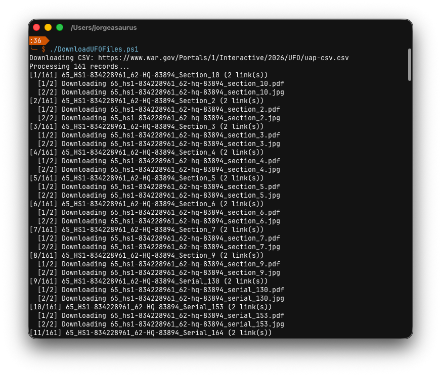
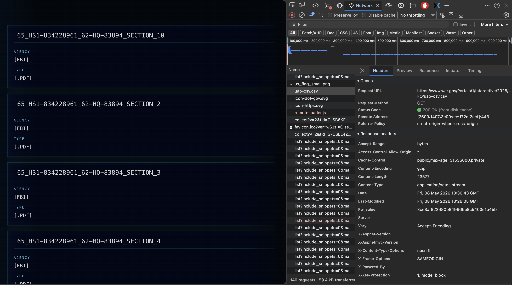
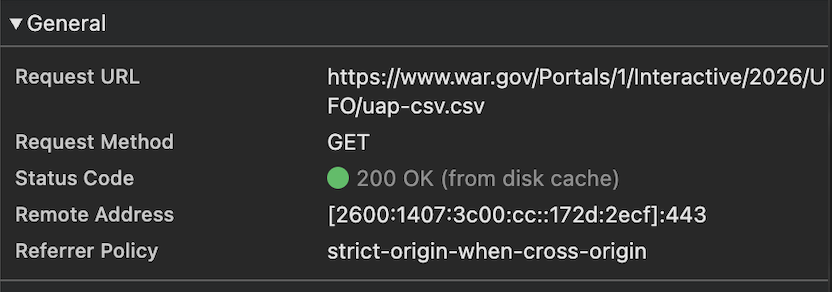

# War.Gov Declassified UFO File Downloader

`DownloadUFOFiles.ps1` downloads UFO files from war.gov and organizes them into per-record folders.

## What it does

The script:

- Downloads or reuses the UFO CSV.
- Reads each CSV row and creates a numbered folder for that record.
- Writes all CSV fields for the record to `info.txt`.
- Extracts linked files from CSV values.
- Downloads each linked file into the record folder.
- Prints record and file download progress to the console.
- Logs failed downloads without stopping the whole run.



## Recommended usage

If you already have the CSV locally:

```powershell
.\DownloadUFOFiles.ps1 -PrimeSession -CsvPath '.\uap-files\uap-csv.csv'
```

If you want the script to download the CSV first:

```powershell
.\DownloadUFOFiles.ps1 -PrimeSession
```

`-PrimeSession` visits `https://www.war.gov/UFO/` before downloading files. Any cookies issued by that page are reused by the same `WebRequestSession` for the CSV and file downloads.

## How this script was created

The war.gov UFO page loads its records from a CSV file. I used the browser developer tools Network tab to inspect the page traffic and identify the CSV request:



The selected request showed that the page was reading:

```text
https://www.war.gov/Portals/1/Interactive/2026/UFO/uap-csv.csv
```



Once the CSV endpoint was identified, the script could read that CSV directly, extract the linked `/medialink/` and `/Portals/` file URLs from each row, and download those files into folders named from the CSV record titles.

## Output

By default, files are written to:

```text
.\DownloadUFOFiles
```

Each CSV record gets a folder like:

```text
001-65_HS1-834228961_62-HQ-83894_Section_10
```

Each folder contains:

- `info.txt` with the CSV metadata.
- Downloaded files such as `.pdf` and `.jpg`.
- `download-errors.txt` if any linked downloads failed.
- `.url` files for failed links.

Example downloaded record:


```text
Redaction:
Release Date: 5/8/26
Title: NASA-UAP-VM3, Apollo 12, 1969
Type: IMG
Video Pairing:
PDF Pairing:
Description Blurb: This archival photograph depicts the lunar surface as viewed from the landing site of Apollo 12. This image features a highlighted area of interest near the right edge of the frame, above the horizon, in which unidentified phenomena are visible. This image has been modified from its original state to assist viewers in identifying specific areas of interest. These highlights are provided for contextual purposes only. Such alterations do not constitute an analytical judgment, investigative conclusion, or factual determination regarding the nature or significance of the subject matter.
DVIDS Video ID:
Video Title:
Agency: NASA
Incident Date: 1969
Incident Location: Moon
PDF | Image Link: https://www.war.gov/medialink/ufo/release_1/nasa-uap-vm3-apollo-12-1969.jpg
Modal Image: https://www.war.gov/medialink/ufo/release_1/thumbnail/nasa-uap-vm3-apollo-12-1969.jpg
```

## Options

| Parameter | Description |
| --- | --- |
| `-CsvUrl` | Source CSV URL. Defaults to the war.gov UFO CSV. |
| `-CsvPath` | Use an existing local CSV instead of downloading one. |
| `-OutputPath` | Output folder. Defaults to `DownloadUFOFiles`. |
| `-PrimeSession` | Visit the UFO landing page first and reuse server-issued cookies. |
| `-PrimeUri` | Landing page URLs to try when priming the session. |
| `-UserAgent` | Browser-like user agent used for requests. |
| `-Referer` | Referer header used for requests. |

## Notes

This script works with the current war.gov UFO page and CSV layout. It depends on the CSV staying available and continuing to contain the file links in a compatible format, so there is no guarantee it will keep working if the site structure, CSV schema, URLs, or server-side download behavior changes.

The script does not bypass server-side access controls. If a specific file is blocked or missing, the failure is logged and the rest of the CSV continues processing.
